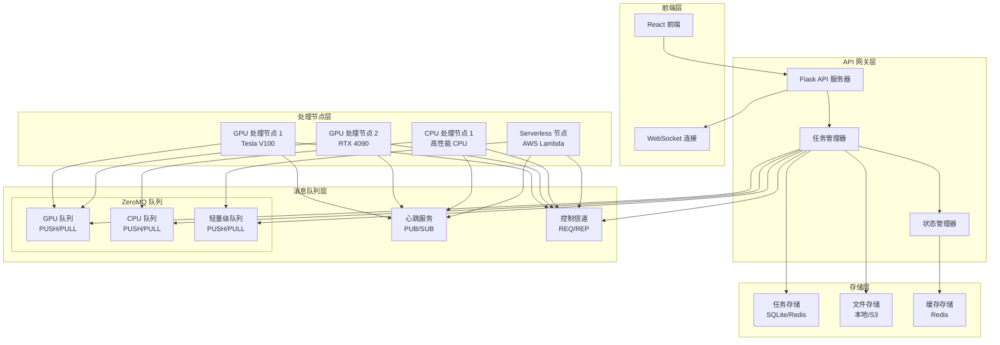

# 设计文档

## 概述

本设计文档描述了将 Lama Cleaner 从同步处理模式改造为分布式生产者-消费者架构的详细方案。新架构使用 ZeroMQ 作为消息传输层，支持多个处理节点并行处理图像修复任务，实现高可用性、可扩展性和容错能力。

## 架构

### 整体架构图



### 核心组件

#### 1. API 网关层 (Gateway Layer)

**Flask API 服务器**
- 保持现有的 REST API 兼容性
- 处理文件上传和下载
- 用户认证和授权
- 请求验证和预处理

**任务管理器 (Task Manager)**
- 接收前端请求并转换为任务
- 根据任务类型路由到相应队列
- 任务状态跟踪和更新
- 任务取消和重试逻辑

**状态管理器 (State Manager)**
- 维护任务状态缓存
- 处理 WebSocket 实时通信
- 节点状态监控
- 系统指标收集

#### 2. 消息队列层 (Message Queue Layer)

**ZeroMQ 队列设计**
```python
# 队列类型定义
QUEUE_TYPES = {
    "gpu-high": {
        "port": 5555,
        "pattern": "PUSH/PULL",
        "requirements": ["gpu", "memory>=8GB", "models=['sd', 'lama']"]
    },
    "gpu-medium": {
        "port": 5556,
        "pattern": "PUSH/PULL", 
        "requirements": ["gpu", "memory>=4GB", "models=['lama', 'mat']"]
    },
    "cpu-intensive": {
        "port": 5557,
        "pattern": "PUSH/PULL",
        "requirements": ["cpu_cores>=8", "memory>=16GB"]
    },
    "cpu-light": {
        "port": 5558,
        "pattern": "PUSH/PULL",
        "requirements": ["cpu_cores>=4", "memory>=8GB"]
    }
}
```

**心跳服务**
- 使用 PUB/SUB 模式
- 节点定期发送心跳信息
- 调度器监控节点健康状态
- 自动故障检测和恢复

**控制信道**
- 使用 REQ/REP 模式
- 节点注册和注销
- 任务取消指令
- 配置更新通知

#### 3. 处理节点层 (Worker Node Layer)

**节点能力配置**
```python
class NodeCapability:
    def __init__(self):
        self.node_id = str(uuid.uuid4())
        self.gpu_info = self.detect_gpu()
        self.cpu_info = self.detect_cpu()
        self.memory_info = self.detect_memory()
        self.supported_models = self.detect_models()
        self.max_concurrent_tasks = self.calculate_concurrency()
        
    def get_queue_subscriptions(self):
        """根据节点能力返回可订阅的队列列表"""
        subscriptions = []
        if self.gpu_info.memory >= 8:
            subscriptions.append("gpu-high")
        elif self.gpu_info.memory >= 4:
            subscriptions.append("gpu-medium")
        
        if self.cpu_info.cores >= 8:
            subscriptions.append("cpu-intensive")
        elif self.cpu_info.cores >= 4:
            subscriptions.append("cpu-light")
            
        return subscriptions
```

**节点生命周期管理**
- 启动时自动注册能力
- 动态订阅匹配的队列
- 优雅关闭和资源清理
- 异常恢复和重连机制

## 组件和接口

### 1. 任务定义

```python
from dataclasses import dataclass
from typing import Optional, Dict, Any
from enum import Enum
import uuid
from datetime import datetime

class TaskType(Enum):
    INPAINT = "inpaint"
    PLUGIN = "plugin"
    UPSCALE = "upscale"

class TaskStatus(Enum):
    PENDING = "pending"
    QUEUED = "queued"
    PROCESSING = "processing"
    COMPLETED = "completed"
    FAILED = "failed"
    CANCELLED = "cancelled"

class TaskPriority(Enum):
    LOW = 1
    NORMAL = 2
    HIGH = 3
    URGENT = 4

@dataclass
class Task:
    task_id: str
    task_type: TaskType
    status: TaskStatus
    priority: TaskPriority
    created_at: datetime
    updated_at: datetime
    
    # 输入数据
    image_data: bytes
    mask_data: Optional[bytes]
    config: Dict[str, Any]
    
    # 处理信息
    assigned_node: Optional[str]
    queue_name: Optional[str]
    retry_count: int = 0
    max_retries: int = 3
    
    # 结果数据
    result_data: Optional[bytes] = None
    error_message: Optional[str] = None
    processing_time: Optional[float] = None
    
    # 元数据
    user_id: Optional[str] = None
    session_id: Optional[str] = None
    metadata: Dict[str, Any] = None
```

### 2. 队列管理接口

```python
class QueueManager:
    def __init__(self, zmq_context):
        self.context = zmq_context
        self.queues = {}
        self.setup_queues()
    
    def setup_queues(self):
        """初始化所有队列"""
        for queue_name, config in QUEUE_TYPES.items():
            socket = self.context.socket(zmq.PUSH)
            socket.bind(f"tcp://*:{config['port']}")
            self.queues[queue_name] = {
                'socket': socket,
                'config': config,
                'pending_count': 0,
                'processing_count': 0
            }
    
    def route_task(self, task: Task) -> str:
        """根据任务需求路由到合适的队列"""
        required_resources = self.analyze_task_requirements(task)
        suitable_queues = self.find_suitable_queues(required_resources)
        
        if not suitable_queues:
            raise ValueError("No suitable queue found for task")
        
        # 选择负载最轻的队列
        selected_queue = min(suitable_queues, 
                           key=lambda q: self.queues[q]['pending_count'])
        
        return selected_queue
    
    def send_task(self, queue_name: str, task: Task):
        """发送任务到指定队列"""
        task_data = self.serialize_task(task)
        self.queues[queue_name]['socket'].send_multipart([
            queue_name.encode(),
            task.task_id.encode(),
            task_data
        ])
        self.queues[queue_name]['pending_count'] += 1
```

### 3. 节点管理接口

```python
class WorkerNode:
    def __init__(self, node_config):
        self.node_id = str(uuid.uuid4())
        self.config = node_config
        self.capability = NodeCapability()
        self.context = zmq.Context()
        self.current_tasks = {}
        self.is_running = False
        
    def start(self):
        """启动工作节点"""
        self.register_node()
        self.setup_sockets()
        self.start_heartbeat()
        self.start_task_processing()
        
    def register_node(self):
        """向调度器注册节点"""
        reg_socket = self.context.socket(zmq.REQ)
        reg_socket.connect("tcp://scheduler:5559")
        
        registration_data = {
            'node_id': self.node_id,
            'capability': self.capability.to_dict(),
            'timestamp': datetime.now().isoformat()
        }
        
        reg_socket.send_json({
            'action': 'register',
            'data': registration_data
        })
        
        response = reg_socket.recv_json()
        if response['status'] == 'success':
            self.subscriptions = response['subscriptions']
        else:
            raise RuntimeError(f"Registration failed: {response['error']}")
            
    def setup_sockets(self):
        """设置队列连接"""
        self.task_sockets = {}
        for queue_name in self.subscriptions:
            socket = self.context.socket(zmq.PULL)
            socket.connect(f"tcp://scheduler:{QUEUE_TYPES[queue_name]['port']}")
            self.task_sockets[queue_name] = socket
            
    def process_task(self, task: Task) -> Task:
        """处理单个任务"""
        try:
            task.status = TaskStatus.PROCESSING
            task.assigned_node = self.node_id
            task.updated_at = datetime.now()
            
            # 发送状态更新
            self.send_status_update(task)
            
            # 执行实际处理
            if task.task_type == TaskType.INPAINT:
                result = self.process_inpaint_task(task)
            elif task.task_type == TaskType.PLUGIN:
                result = self.process_plugin_task(task)
            else:
                raise ValueError(f"Unsupported task type: {task.task_type}")
            
            task.result_data = result
            task.status = TaskStatus.COMPLETED
            task.processing_time = (datetime.now() - task.updated_at).total_seconds()
            
        except Exception as e:
            task.status = TaskStatus.FAILED
            task.error_message = str(e)
            logger.exception(f"Task {task.task_id} failed")
            
        finally:
            task.updated_at = datetime.now()
            self.send_status_update(task)
            
        return task
```

### 4. 状态管理接口

```python
class StateManager:
    def __init__(self, redis_client, socketio):
        self.redis = redis_client
        self.socketio = socketio
        self.task_states = {}
        
    def update_task_status(self, task: Task):
        """更新任务状态"""
        # 更新内存缓存
        self.task_states[task.task_id] = {
            'status': task.status.value,
            'progress': self.calculate_progress(task),
            'updated_at': task.updated_at.isoformat(),
            'assigned_node': task.assigned_node,
            'error_message': task.error_message
        }
        
        # 持久化到 Redis
        self.redis.hset(
            f"task:{task.task_id}",
            mapping=self.task_states[task.task_id]
        )
        
        # 实时通知前端
        self.socketio.emit('task_update', {
            'task_id': task.task_id,
            'status': task.status.value,
            'progress': self.calculate_progress(task),
            'message': self.get_status_message(task)
        })
        
    def get_task_status(self, task_id: str) -> Dict:
        """获取任务状态"""
        # 先从内存缓存获取
        if task_id in self.task_states:
            return self.task_states[task_id]
            
        # 从 Redis 获取
        task_data = self.redis.hgetall(f"task:{task_id}")
        if task_data:
            self.task_states[task_id] = task_data
            return task_data
            
        return None
        
    def cancel_task(self, task_id: str) -> bool:
        """取消任务"""
        task_state = self.get_task_status(task_id)
        if not task_state:
            return False
            
        if task_state['status'] in ['completed', 'failed', 'cancelled']:
            return False
            
        if task_state['status'] == 'pending':
            # 任务还在队列中，直接标记为取消
            self.update_task_status_direct(task_id, TaskStatus.CANCELLED)
            return True
            
        if task_state['status'] == 'processing':
            # 任务正在处理，发送取消指令给处理节点
            self.send_cancel_command(task_id, task_state['assigned_node'])
            return True
            
        return False
```

## 数据模型

### 1. 数据库设计

```sql
-- 任务表
CREATE TABLE tasks (
    id VARCHAR(36) PRIMARY KEY,
    task_type VARCHAR(20) NOT NULL,
    status VARCHAR(20) NOT NULL,
    priority INTEGER DEFAULT 2,
    created_at TIMESTAMP DEFAULT CURRENT_TIMESTAMP,
    updated_at TIMESTAMP DEFAULT CURRENT_TIMESTAMP,
    assigned_node VARCHAR(36),
    queue_name VARCHAR(50),
    retry_count INTEGER DEFAULT 0,
    max_retries INTEGER DEFAULT 3,
    user_id VARCHAR(36),
    session_id VARCHAR(36),
    config TEXT,
    error_message TEXT,
    processing_time REAL,
    metadata TEXT
);

-- 节点表
CREATE TABLE nodes (
    id VARCHAR(36) PRIMARY KEY,
    node_type VARCHAR(20) NOT NULL,
    status VARCHAR(20) NOT NULL,
    capability TEXT NOT NULL,
    last_heartbeat TIMESTAMP,
    created_at TIMESTAMP DEFAULT CURRENT_TIMESTAMP,
    updated_at TIMESTAMP DEFAULT CURRENT_TIMESTAMP,
    total_processed INTEGER DEFAULT 0,
    current_load INTEGER DEFAULT 0
);

-- 队列统计表
CREATE TABLE queue_stats (
    queue_name VARCHAR(50) PRIMARY KEY,
    pending_count INTEGER DEFAULT 0,
    processing_count INTEGER DEFAULT 0,
    completed_count INTEGER DEFAULT 0,
    failed_count INTEGER DEFAULT 0,
    updated_at TIMESTAMP DEFAULT CURRENT_TIMESTAMP
);
```

### 2. 文件存储结构

```
storage/
├── tasks/
│   ├── {task_id}/
│   │   ├── input.jpg          # 原始图像
│   │   ├── mask.png           # 遮罩图像
│   │   ├── result.jpg         # 处理结果
│   │   ├── config.json        # 任务配置
│   │   └── metadata.json      # 元数据
├── temp/
│   └── {session_id}/          # 临时文件
├── cache/
│   └── models/                # 模型缓存
└── logs/
    ├── tasks/                 # 任务日志
    ├── nodes/                 # 节点日志
    └── system/                # 系统日志
```

## 错误处理

### 1. 错误分类和处理策略

```python
class ErrorHandler:
    def __init__(self):
        self.error_strategies = {
            'network_error': self.handle_network_error,
            'resource_error': self.handle_resource_error,
            'model_error': self.handle_model_error,
            'timeout_error': self.handle_timeout_error,
            'validation_error': self.handle_validation_error
        }
    
    def handle_task_error(self, task: Task, error: Exception):
        """统一错误处理入口"""
        error_type = self.classify_error(error)
        handler = self.error_strategies.get(error_type, self.handle_unknown_error)
        
        return handler(task, error)
    
    def handle_network_error(self, task: Task, error: Exception):
        """网络错误处理"""
        if task.retry_count < task.max_retries:
            # 重试任务
            task.retry_count += 1
            task.status = TaskStatus.PENDING
            return 'retry'
        else:
            # 标记为失败
            task.status = TaskStatus.FAILED
            task.error_message = f"Network error after {task.max_retries} retries: {str(error)}"
            return 'failed'
    
    def handle_resource_error(self, task: Task, error: Exception):
        """资源不足错误处理"""
        if "CUDA out of memory" in str(error):
            # 尝试降级到 CPU 队列
            return self.downgrade_task_queue(task)
        elif "out of memory" in str(error).lower():
            # 等待资源释放后重试
            return 'wait_and_retry'
        else:
            task.status = TaskStatus.FAILED
            task.error_message = f"Resource error: {str(error)}"
            return 'failed'
```

### 2. 容错机制

**节点故障恢复**
```python
class NodeFailureHandler:
    def __init__(self, task_manager):
        self.task_manager = task_manager
        self.failed_nodes = set()
        
    def handle_node_failure(self, node_id: str):
        """处理节点故障"""
        logger.warning(f"Node {node_id} failed, recovering tasks...")
        
        # 标记节点为失败状态
        self.failed_nodes.add(node_id)
        
        # 获取该节点正在处理的任务
        active_tasks = self.task_manager.get_tasks_by_node(node_id)
        
        for task in active_tasks:
            if task.retry_count < task.max_retries:
                # 重新排队
                task.status = TaskStatus.PENDING
                task.assigned_node = None
                task.retry_count += 1
                self.task_manager.requeue_task(task)
            else:
                # 标记为失败
                task.status = TaskStatus.FAILED
                task.error_message = f"Node {node_id} failed, max retries exceeded"
                self.task_manager.update_task(task)
```

**队列溢出处理**
```python
class QueueOverflowHandler:
    def __init__(self, max_queue_size=1000):
        self.max_queue_size = max_queue_size
        
    def handle_queue_overflow(self, queue_name: str, task: Task):
        """处理队列溢出"""
        current_size = self.get_queue_size(queue_name)
        
        if current_size >= self.max_queue_size:
            if task.priority == TaskPriority.URGENT:
                # 紧急任务，移除最老的低优先级任务
                self.evict_low_priority_task(queue_name)
                return 'accepted'
            else:
                # 拒绝任务
                return 'rejected'
        
        return 'accepted'
```

## 测试策略

### 1. 单元测试

```python
class TestTaskManager(unittest.TestCase):
    def setUp(self):
        self.task_manager = TaskManager()
        self.mock_queue = Mock()
        
    def test_task_routing(self):
        """测试任务路由逻辑"""
        task = Task(
            task_id="test-001",
            task_type=TaskType.INPAINT,
            config={"model": "sd15", "gpu_required": True}
        )
        
        queue_name = self.task_manager.route_task(task)
        self.assertIn("gpu", queue_name)
        
    def test_task_cancellation(self):
        """测试任务取消功能"""
        task = self.create_test_task()
        self.task_manager.submit_task(task)
        
        result = self.task_manager.cancel_task(task.task_id)
        self.assertTrue(result)
        
        updated_task = self.task_manager.get_task(task.task_id)
        self.assertEqual(updated_task.status, TaskStatus.CANCELLED)
```

### 2. 集成测试

```python
class TestDistributedProcessing(unittest.TestCase):
    def setUp(self):
        self.setup_test_cluster()
        
    def test_end_to_end_processing(self):
        """端到端处理测试"""
        # 提交任务
        task_id = self.submit_test_task()
        
        # 等待处理完成
        result = self.wait_for_completion(task_id, timeout=60)
        
        # 验证结果
        self.assertIsNotNone(result)
        self.assertEqual(result['status'], 'completed')
        
    def test_node_failure_recovery(self):
        """节点故障恢复测试"""
        # 提交任务
        task_id = self.submit_test_task()
        
        # 模拟节点故障
        self.simulate_node_failure()
        
        # 验证任务被重新分配
        result = self.wait_for_completion(task_id, timeout=120)
        self.assertEqual(result['status'], 'completed')
```

### 3. 性能测试

```python
class TestPerformance(unittest.TestCase):
    def test_throughput(self):
        """吞吐量测试"""
        start_time = time.time()
        task_ids = []
        
        # 提交100个任务
        for i in range(100):
            task_id = self.submit_test_task()
            task_ids.append(task_id)
        
        # 等待所有任务完成
        self.wait_for_all_completion(task_ids)
        
        end_time = time.time()
        throughput = len(task_ids) / (end_time - start_time)
        
        self.assertGreater(throughput, 10)  # 至少10任务/秒
        
    def test_scalability(self):
        """可扩展性测试"""
        # 测试不同节点数量下的性能
        for node_count in [1, 2, 4, 8]:
            self.setup_nodes(node_count)
            throughput = self.measure_throughput()
            
            # 验证性能随节点数量增长
            if node_count > 1:
                self.assertGreater(throughput, previous_throughput * 0.8)
            previous_throughput = throughput
```

这个设计文档提供了一个完整的分布式处理架构，使用 ZeroMQ 作为消息传输层，支持多种类型的处理节点和队列，具备容错能力和可扩展性。设计考虑了现有 API 的兼容性，同时为未来的扩展留下了空间。