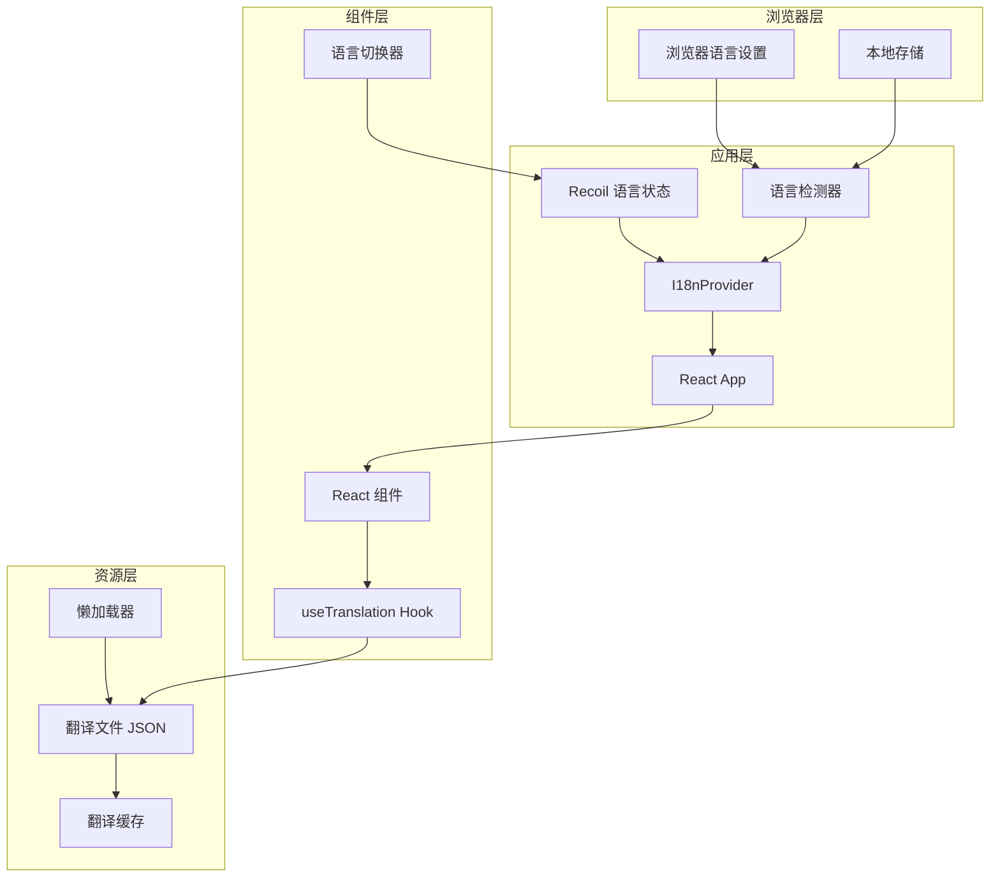

# 国际化设计文档

## 概述

本文档描述了 lama-cleaner React 应用程序的国际化技术设计方案。该方案基于 react-i18next 框架，支持英语和简体中文双语界面，并为未来扩展其他语言版本提供可扩展的架构基础。

## 架构设计

### 核心技术栈

- **国际化框架**: react-i18next v12.1.4
- **核心库**: i18next v22.4.9
- **语言检测**: i18next-browser-languagedetector v7.0.1
- **资源加载**: i18next-http-backend v2.1.1
- **状态管理集成**: Recoil (现有)

### 架构图



## 组件和接口设计

### 1. i18n 配置模块

```typescript
// src/i18n/index.ts
interface I18nConfig {
  fallbackLng: string;
  supportedLngs: string[];
  debug: boolean;
  interpolation: {
    escapeValue: boolean;
  };
  detection: {
    order: string[];
    caches: string[];
  };
  backend: {
    loadPath: string;
  };
}
```

### 2. 翻译资源结构

```typescript
// src/i18n/types.ts
interface TranslationResource {
  common: CommonTranslations;
  editor: EditorTranslations;
  settings: SettingsTranslations;
  errors: ErrorTranslations;
  shortcuts: ShortcutTranslations;
}

interface CommonTranslations {
  buttons: {
    save: string;
    cancel: string;
    upload: string;
    download: string;
    reset: string;
    undo: string;
    redo: string;
  };
  navigation: {
    fileManager: string;
    settings: string;
    shortcuts: string;
  };
  tooltips: {
    uploadImage: string;
    uploadMask: string;
    resetZoom: string;
    showOriginal: string;
  };
}
```

### 3. 自定义 Hooks

```typescript
// src/hooks/useTypedTranslation.ts
export function useTypedTranslation<
  Namespace extends keyof TranslationResource
>(namespace: Namespace) {
  const { t, i18n } = useTranslation(namespace);
  
  return {
    t: (key: keyof TranslationResource[Namespace]) => t(key as string),
    i18n,
  };
}

// src/hooks/useLanguage.ts
export function useLanguage() {
  const [language, setLanguage] = useRecoilState(languageState);
  
  const changeLanguage = async (lng: string) => {
    await i18n.changeLanguage(lng);
    setLanguage(lng);
    localStorage.setItem('preferred-language', lng);
  };
  
  return { language, changeLanguage, supportedLanguages };
}
```

### 4. 语言切换器组件

```typescript
// src/components/Header/LanguageSwitcher.tsx
interface LanguageSwitcherProps {
  className?: string;
}

const LanguageSwitcher: React.FC<LanguageSwitcherProps> = ({ className }) => {
  const { language, changeLanguage, supportedLanguages } = useLanguage();
  
  return (
    <Select value={language} onValueChange={changeLanguage}>
      {/* 渲染语言选项 */}
    </Select>
  );
};
```

## 数据模型

### 1. 语言状态管理

```typescript
// src/store/Atoms.tsx 扩展
export const languageState = atom<string>({
  key: 'languageState',
  default: 'en',
  effects: [
    localStorageEffect('preferred-language'),
    ({ setSelf, onSet }) => {
      // 初始化时从 i18n 获取当前语言
      setSelf(i18n.language || 'en');
      
      // 监听变化并同步到 i18n
      onSet((newValue) => {
        if (i18n.language !== newValue) {
          i18n.changeLanguage(newValue);
        }
      });
    },
  ],
});
```

### 2. 翻译文件结构

```json
// src/i18n/resources/en/common.json
{
  "buttons": {
    "save": "Save",
    "cancel": "Cancel",
    "upload": "Upload",
    "download": "Download",
    "reset": "Reset",
    "undo": "Undo",
    "redo": "Redo"
  },
  "navigation": {
    "fileManager": "File Manager",
    "settings": "Settings",
    "shortcuts": "Keyboard Shortcuts"
  },
  "tooltips": {
    "uploadImage": "Upload image",
    "uploadMask": "Upload custom mask",
    "resetZoom": "Reset Zoom & Pan",
    "showOriginal": "Show Original"
  }
}

// src/i18n/resources/zh-CN/common.json
{
  "buttons": {
    "save": "保存",
    "cancel": "取消",
    "upload": "上传",
    "download": "下载",
    "reset": "重置",
    "undo": "撤销",
    "redo": "重做"
  },
  "navigation": {
    "fileManager": "文件管理器",
    "settings": "设置",
    "shortcuts": "键盘快捷键"
  },
  "tooltips": {
    "uploadImage": "上传图片",
    "uploadMask": "上传自定义蒙版",
    "resetZoom": "重置缩放和平移",
    "showOriginal": "显示原图"
  }
}
```

### 3. 动态内容插值

```typescript
// 使用示例
t('errors.fileTooLarge', { maxSize: '20MB' })
// 英文: "File size exceeds {{maxSize}}"
// 中文: "文件大小超过 {{maxSize}}"

t('editor.processingProgress', { current: 5, total: 10 })
// 英文: "Processing {{current}} of {{total}}"
// 中文: "正在处理 {{current}} / {{total}}"
```

## 错误处理

### 1. 翻译加载失败处理

```typescript
// src/i18n/errorHandler.ts
export const handleTranslationError = (error: Error, namespace: string) => {
  console.error(`Failed to load translations for ${namespace}:`, error);
  
  // 回退策略
  return {
    fallback: true,
    message: `Translation loading failed for ${namespace}`,
  };
};
```

### 2. 语言切换失败处理

```typescript
// src/hooks/useLanguage.ts
const changeLanguage = async (lng: string) => {
  try {
    await i18n.changeLanguage(lng);
    setLanguage(lng);
    localStorage.setItem('preferred-language', lng);
  } catch (error) {
    console.error('Language change failed:', error);
    // 保持当前语言不变
    setToastState({
      open: true,
      desc: t('errors.languageChangeFailed'),
      state: 'error',
      duration: 3000,
    });
  }
};
```

### 3. 缺失翻译键处理

```typescript
// i18n 配置
{
  missingKeyHandler: (lng, ns, key) => {
    if (process.env.NODE_ENV === 'development') {
      console.warn(`Missing translation: ${lng}/${ns}/${key}`);
    }
    // 返回键名作为后备显示
    return key;
  }
}
```

## 测试策略

### 1. 单元测试

```typescript
// src/hooks/__tests__/useLanguage.test.ts
describe('useLanguage Hook', () => {
  it('should initialize with browser language', () => {
    // 测试语言初始化
  });
  
  it('should change language and persist to localStorage', async () => {
    // 测试语言切换和持久化
  });
  
  it('should handle language change failure', async () => {
    // 测试错误处理
  });
});
```

### 2. 组件测试

```typescript
// src/components/__tests__/LanguageSwitcher.test.tsx
describe('LanguageSwitcher Component', () => {
  it('should render available languages', () => {
    // 测试语言选项渲染
  });
  
  it('should trigger language change on selection', () => {
    // 测试语言切换功能
  });
});
```

### 3. 集成测试

```typescript
// src/__tests__/i18n.integration.test.ts
describe('i18n Integration', () => {
  it('should load and apply translations', async () => {
    // 测试翻译加载和应用
  });
  
  it('should fallback to English when translation missing', () => {
    // 测试回退机制
  });
  
  it('should handle dynamic content interpolation', () => {
    // 测试变量插值
  });
});
```

### 4. E2E 测试策略

- 验证语言切换后所有界面元素更新
- 测试语言偏好持久化
- 验证不同语言下的布局适应性
- 测试错误消息的本地化显示

## 性能优化

### 1. 翻译资源懒加载

```typescript
// 按需加载命名空间
const loadNamespace = async (namespace: string) => {
  if (!i18n.hasResourceBundle(i18n.language, namespace)) {
    await i18n.loadNamespaces(namespace);
  }
};
```

### 2. 翻译缓存策略

```typescript
// 使用 localStorage 缓存已加载的翻译
const cacheStrategy = {
  enabled: true,
  expirationTime: 7 * 24 * 60 * 60 * 1000, // 7 天
  versions: {
    en: '1.0.0',
    'zh-CN': '1.0.0',
  },
};
```

### 3. 组件级别优化

```typescript
// 使用 React.memo 避免不必要的重渲染
export const TranslatedComponent = React.memo(({ translationKey }) => {
  const { t } = useTranslation();
  return <div>{t(translationKey)}</div>;
});
```

## 迁移策略

### 阶段 1：基础设施（第 1-2 天）
1. 安装依赖包
2. 创建 i18n 配置
3. 设置 TypeScript 类型
4. 集成 Recoil 状态管理

### 阶段 2：核心组件（第 3-5 天）
1. 迁移 Toast 和错误消息
2. 迁移 Header 组件
3. 迁移 LandingPage
4. 添加语言切换器

### 阶段 3：主要功能（第 6-8 天）
1. 迁移 Settings 组件
2. 迁移 Editor 界面
3. 迁移 FileManager

### 阶段 4：完善和测试（第 9-10 天）
1. 迁移剩余组件
2. 添加缺失的翻译
3. 执行测试计划
4. 性能优化

## 兼容性考虑

### 1. 浏览器兼容性
- 支持所有现代浏览器（Chrome, Firefox, Safari, Edge）
- IE11 需要额外的 polyfills

### 2. 与现有代码的兼容
- 保持现有组件 API 不变
- 渐进式迁移，不影响未迁移组件
- 保持与现有 Recoil 状态管理的兼容

### 3. 未来扩展性
- 预留繁体中文（zh-TW）支持
- 支持 RTL 语言的架构准备
- 插件系统的国际化接口

## 安全考虑

### 1. XSS 防护
```typescript
// i18n 配置中禁用 HTML 转义
interpolation: {
  escapeValue: true, // 防止 XSS 攻击
}
```

### 2. 用户输入验证
```typescript
// 验证语言代码防止注入
const isValidLanguageCode = (code: string) => {
  return /^[a-z]{2}(-[A-Z]{2})?$/.test(code);
};
```

## 监控和日志

### 1. 开发环境
```typescript
// 开发模式下启用详细日志
debug: process.env.NODE_ENV === 'development'
```

### 2. 生产环境
```typescript
// 记录关键错误
window.addEventListener('i18n-error', (event) => {
  // 发送到错误追踪服务
  trackError('i18n', event.detail);
});
```